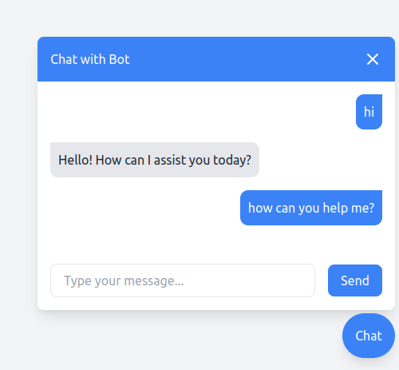

# Chat Widget Azure AI Service 

This is quick solution that I developed to integrate Chat service deployed on Azure AI Studio. 

## How it works ?

1. Install `http-server` using following:

    `npm i -g http-server`

2. Setup Azure Key and Endpoint

    Update the variable `azureOpenaiApiKey` and `azureOpenaiEndpoint`

3. Run the command in root folder:

    `http-server`

4. Open link `http://127.0.0.1:8080`

## Plain HTML Code

You can use `vanilla-chat.html` to view the widget directly in the browser without server.

## Roadmap

1. Support for markdown
2. Create NPM package